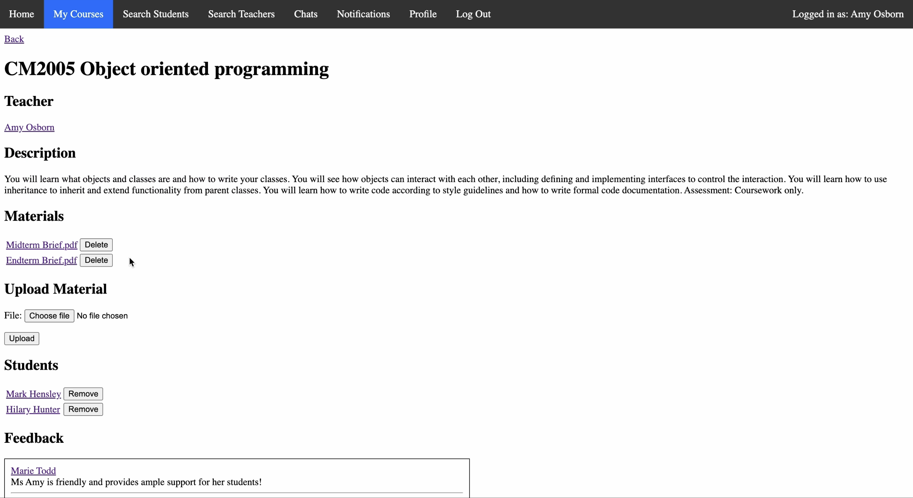

# Student-Teacher Portal

## About

This application is a web-based platform built with Django that allows students and teachers to manage their courses. It involves creating, retrieving, updating and deleting courses and materials using Django REST Framework. Students can also enrol in courses, post statuses and submit course feedback. Additionally, a chat function implemented using Django Channels and Websockets allows students and teachers to communicate in real time. The application features the use of models and migrations, as well as the use of forms, validators and serialisation. It also supports unit testing and includes a script for bulk loading data into the database.
